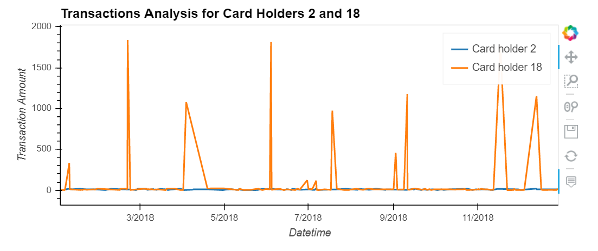
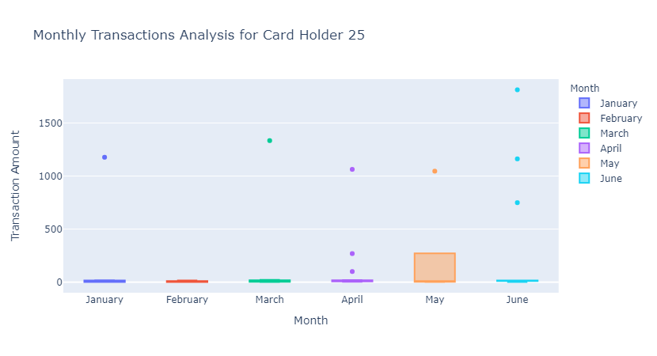

# Unit-7-Homework-Assignment-Looking-for-Suspicious-Transactions

## Background
Fraud is prevalent these days, whether you are a small taco shop or a large international business. While there are emerging technologies that employ machine learning and artificial intelligence to detect fraud, many instances of fraud detection still require strong data analytics to find abnormal charges.
In this homework assignment, you will apply your new SQL skills to analyze historical credit card transactions and consumption patterns in order to identify possible fraudulent transactions.
You are asked to accomplish three main tasks:

1. Data Modeling: Define a database model to store the credit card transactions data and create a new PostgreSQL database using your model.

2. Data Engineering: Create a database schema on PostgreSQL and populate your  database from the CSV files provided.

3. Data Analysis: Analyze the data to identify possible fraudulent transactions.

## Instructions 1

Using a Jupyter Notebook, your report should do the following:

* Isolate (or group) the transactions of each cardholder.

* Consider the time period 7:00 a.m. to 9:00 a.m.

* Show the top 100 highest transactions during this time period.

## Instructions 2
Some fraudsters hack a credit card by making several small payments (generally less than $2.00), which are typically ignored by cardholders. Count the transactions that are less than $2.00 per cardholder. 

### Question 2
Is there any evidence to suggest that a credit card has been hacked? Explain your rationale.

*Answer*: 
Isolating the payments that are less than 2.00 per cardholder I found a total of 350 transactions out of 3500, what is not sufficient to say that any cardholder has in fact been hacked or not.

## Instructions 3
Verify if there are any fraudulent transactions in the history of two of the most important customers of the firm. For privacy reasons, you only know that their cardholders' IDs are 18 and 2.

Using hvPlot, create a line plot representing the time series of transactions over the course of the year for each cardholder. In order to compare the patterns of both cardholders, create a line plot containing both lines. 

### Question 3

What difference do you observe between the consumption patterns? Does the difference suggest a fraudulent transaction? Explain your rationale.

*Answer*: 

After visually analyzed the spending patterns, it can be concluded that there may be some fraudulent transactions in the cardholder 18 records since there are some anomalous amounts throughout the year that break the typical spending pattern that can be seen on cardholder 2.

## Instructions 4

The CEO of the biggest customer of the firm suspects that someone has used her corporate credit card without authorization in the first quarter of 2018 to pay quite expensive restaurant bills. You are asked to find any anomalous transactions during that period.

Using Plotly Express, create a series of six box plots, one for each month, in order to identify how many outliers per month for cardholder ID 25.

### Question 4
Do you notice any anomalies? Describe your observations and conclusions.

*Answer*: 

It can be concluded that cardholder 25 has been hacked along all the first semester of 2018 due to the high and consistent expenditures, except for February where there are not anomalous transactions.